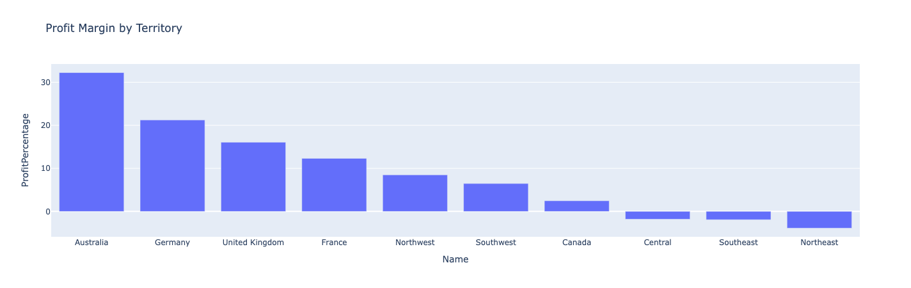
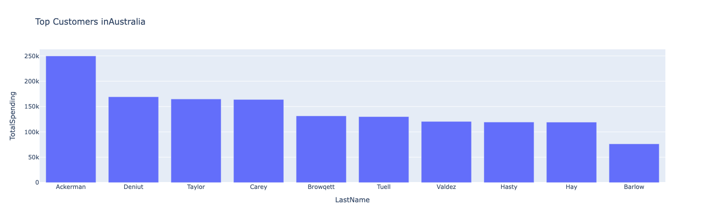
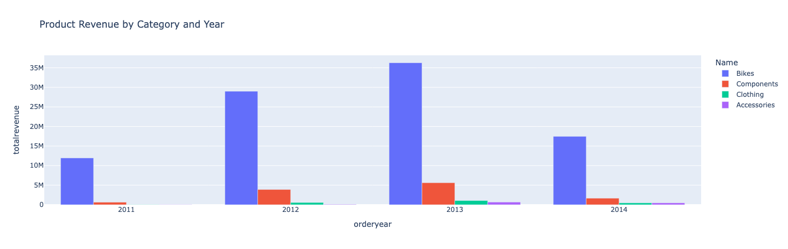
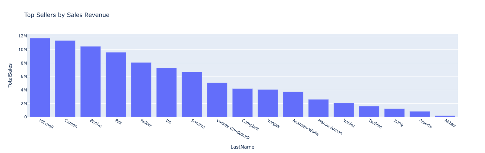

# AdventureWorks Sales Analytics Dashboard

An end-to-end data analytics project built with Python, SQL, Pandas, and Dash. The project connects live to a Microsoft SQL Server database (AdventureWorks), extracts data through business-driven SQL queries, and visualizes insights through an interactive web dashboard.

---

## Business Questions

This project was built around four real business questions:

1. **Which territories have high sales but poor profit margin** — so stakeholders can investigate and reduce costs?
2. **Which customers in each territory spend above average** — so we can target them with personalized offers?
3. **Which are the best and worst performing product categories over the years** — so we can focus investment and discontinue poor sellers?
4. **Which are our top performing sellers** — so we can motivate them with bigger bonuses?

---

## Dashboard Preview

### Profit Margin by Territory


### Top Customers by Territory (Interactive)


### Product Revenue by Category and Year


### Top Sellers by Sales Revenue


---

## Tech Stack

| Tool | Purpose |
|------|---------|
| SQL Server | Source database (AdventureWorks) |
| pyodbc | Live database connection |
| Pandas | Data extraction and analysis |
| Plotly | Interactive charts |
| Dash | Web-based dashboard |
| Python-dotenv | Secure credential management |

---

## Project Structure

```
sql_pandas_project/
│
├── analysis/                  # Data extraction scripts
│   ├── territory_profit.py
│   ├── customer_spending.py
│   ├── product_performance.py
│   └── top_sellers.py
│
├── queries/                   # SQL queries
│   ├── territory_profit.sql
│   ├── customer_spending.sql
│   ├── product_performance.sql
│   └── top_sellers.sql
│
├── dashboard/                 # Dash web app
│   └── app.py
│
├── screenshots/               # Dashboard screenshots
├── db_connection.py           # Database connection
├── requirements.txt           # Dependencies
└── README.md
```

---

## How to Run Locally

**1. Clone the repository**
```bash
git clone https://github.com/orselk98/sql_pandas_adv.git
cd sql_pandas_adv
```

**2. Create and activate virtual environment**
```bash
python3 -m venv venv
source venv/bin/activate
```

**3. Install dependencies**
```bash
pip install -r requirements.txt
```

**4. Create a `.env` file in the project root**
```
SERVER=your_server_address
DATABASE=AdventureWorks
USERNAME=your_username
PASSWORD=your_password
```

**5. Run the dashboard**
```bash
python dashboard/app.py
```

Open your browser at `http://127.0.0.1:8050`

---

## Key Insights

- **Australia** has the highest profit margin (32%) despite not being the top revenue territory
- **Southwest** generates the most revenue ($24M) but has only 6.5% profit margin — a cost efficiency problem
- **Bikes** dominate revenue across all years but have thin margins compared to Accessories
- **Linda Mitchell** is the top performing seller with over $11M in total sales
- Three territories — Central, Southeast, and Northeast — operate at **negative profit margins**

---

## Author

**Orsel** — MBA | Data Analyst in transition | Python · SQL · Pandas · Dash

[GitHub](https://github.com/orselk98)